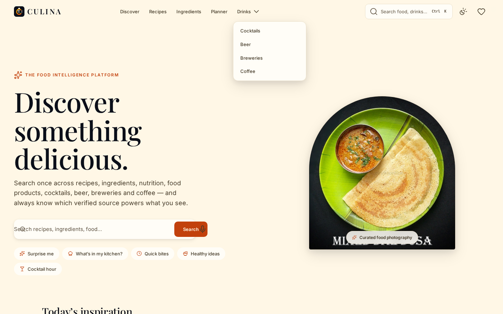
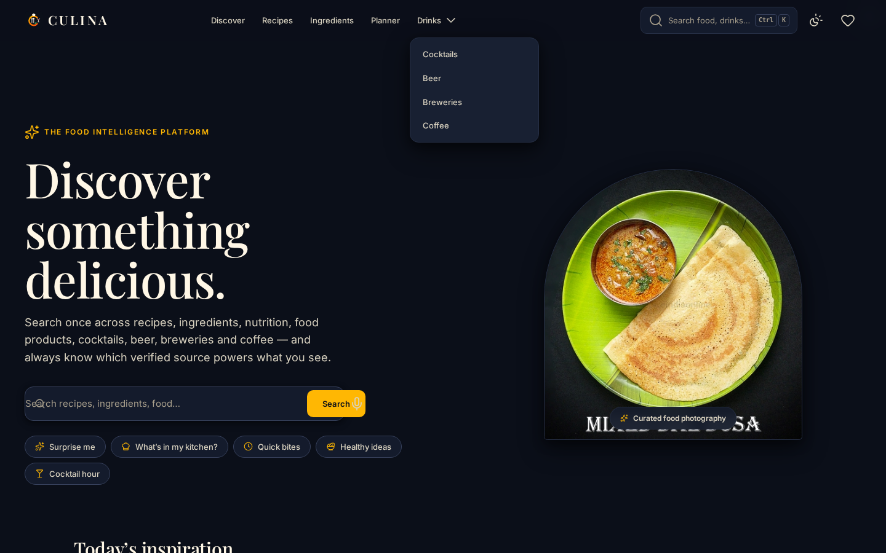
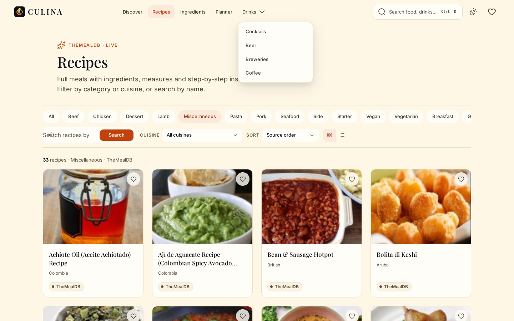
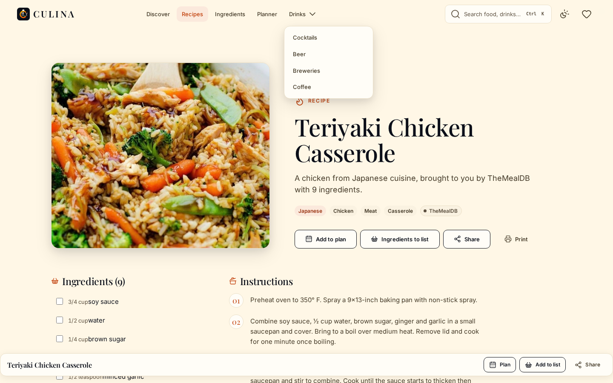
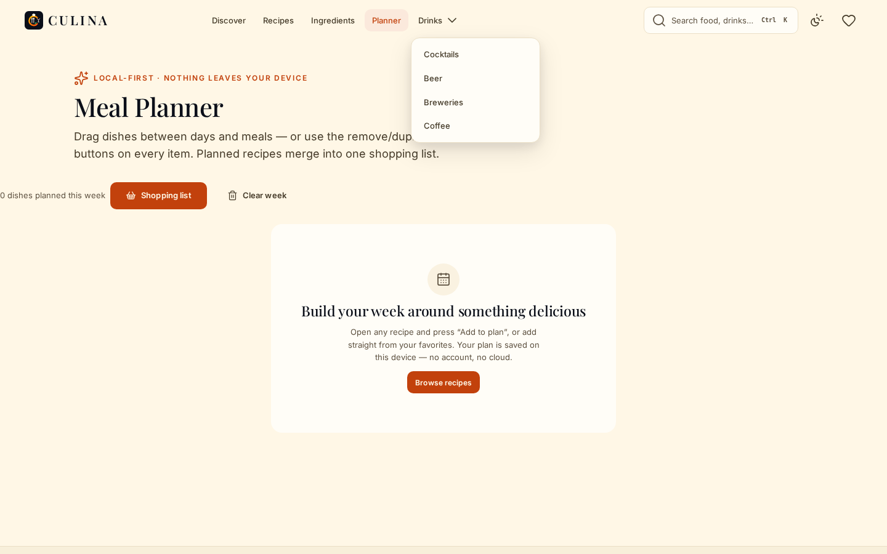
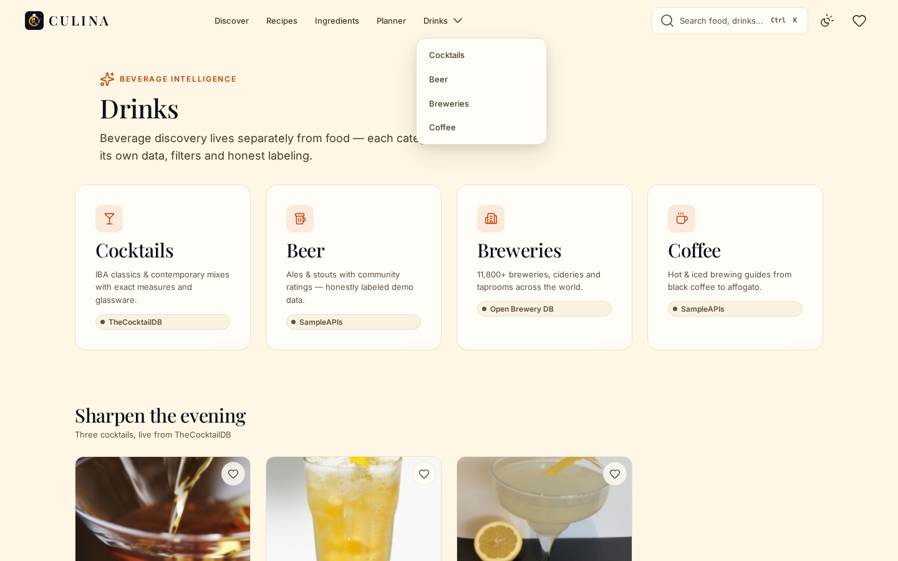
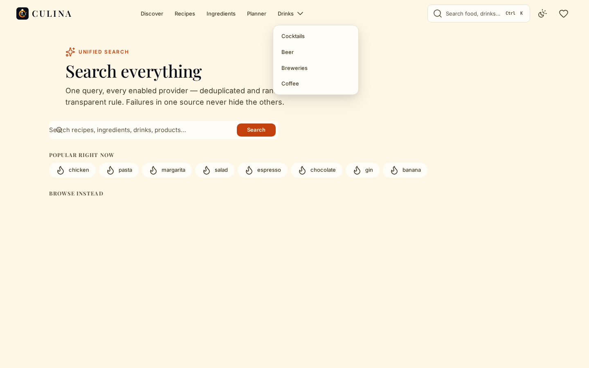
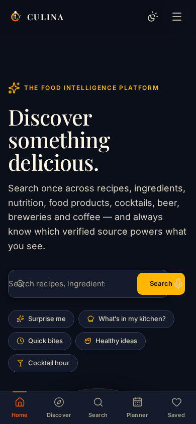

<p align="center"></p>

<h1 align="center">CULINA</h1>

<p align="center"><strong>The Interactive Food Intelligence &amp; Discovery Platform</strong></p>

<p align="center"><em>Discover food. Understand it. Make it yours.</em><br>TASTE • DISCOVER • PLAN • ENJOY</p>

<p align="center">
<a href="https://devara1983ntr.github.io/culina/"></a>
<a href="https://github.com/devara1983ntr/culina/actions/workflows/ci.yml"></a>

<a href="LICENSE"></a>
</p>

CULINA unifies recipes, ingredients, fruit nutrition, packaged food products, cocktails, beer, breweries and coffee from multiple independent open-data sources into **one coherent, editorial-grade product** — with honest labeling of every data source, graceful degradation when a provider fails, and a local-first privacy model: **no accounts, no tracking, no cloud, no AI, no fabricated data.**

- **Live application:** <https://devara1983ntr.github.io/culina/> (GitHub Pages, static)
- **Repository:** <https://github.com/devara1983ntr/culina> · default branch `main`
- **Current release:** v1.4.0 (2026) · [CHANGELOG](CHANGELOG.md)

---

## Contents

1. [Product overview & core principles](#product-overview--core-principles)
2. [Screenshots](#screenshots)
3. [Features](#features)
4. [Routes & surfaces (34)](#routes--surfaces-34)
5. [Architecture & data flow](#architecture--data-flow)
6. [Provider matrix](#provider-matrix)
7. [Real-data policy (no fake data)](#real-data-policy-no-fake-data)
8. [Gateway & security model](#gateway--security-model)
9. [Privacy, storage & local-first behavior](#privacy-storage--local-first-behavior)
10. [PWA & offline behavior](#pwa--offline-behavior)
11. [Design system & brand identity](#design-system--brand-identity)
12. [Motion & gesture system](#motion--gesture-system)
13. [Responsive design & accessibility](#responsive-design--accessibility)
14. [Development setup](#development-setup)
15. [Production setup & npm scripts](#production-setup--npm-scripts)
16. [Testing strategy & quality gates](#testing-strategy--quality-gates)
17. [CI/CD & deployment](#cicd--deployment)
18. [Browser support](#browser-support)
19. [Known limitations](#known-limitations)
20. [Troubleshooting](#troubleshooting)
21. [Project structure](#project-structure)
22. [Repository hygiene policy](#repository-hygiene-policy)
23. [Contributing, security reporting & conduct](#contributing-security-reporting--conduct)
24. [License & third-party attribution](#license--third-party-attribution)

---

## Product overview & core principles

CULINA is a client-side food discovery platform. Everything a user creates — favorites, meal plans, shopping lists, search history, settings — stays in their browser. Everything a user reads comes from real, attributed open-data providers; when a provider is slow, rate-limited or down, the app says so precisely instead of inventing content.

**Core principles (enforced by tests, audits and CI — not aspirations):**

1. **Real data only.** Provider → adapter → normalizer → unified model → state → UI. Unknown values become `null`, never `0`, never fabricated. No mock/dummy/placeholder product data exists anywhere in runtime code.
2. **Honest states everywhere.** Every async surface has loading (skeletons), empty, error, partial-failure and retry/recovery states with precise copy.
3. **Local-first privacy.** No accounts, no analytics, no tracking cookies, no outbound user data. `localStorage` only; clearing site data resets everything.
4. **Preservation over novelty.** Every screen, feature and provider integration ships with a visible accessible twin for every gesture enhancement.
5. **Verifiable quality.** 77 unit tests, a static consistency audit, 397 gateway assertions and a 92-check browser E2E suite run on two engines in CI on every push.

## Screenshots

| Home (light) | Home (dark) |
| --- | --- |
|  |  |

| Recipes | Recipe detail | Meal planner |
| --- | --- | --- |
|  |  |  |

| Drinks | Search | Mobile (390 px) |
| --- | --- | --- |
|  |  |  |

All screenshots are real captures of the running production build (Chromium 1440×900 / 390×844).

## Features

| Area | Highlights |
| --- | --- |
| **Unified search** (`/search`) | One query across the 7 live content providers (recipes, cocktails, fruits, products, breweries, beers, coffee) — `Promise.allSettled` isolation, dedupe, deterministic scoring, per-group ranking, honest per-provider failure notices |
| **Discover** (`/discover`) | Tabbed entity browser (recipes · ingredients · products · cocktails · beers · coffee) with filter chips, tab-swipe and URL-synced state |
| **What can I cook?** (`/kitchen`) | Add what's in your kitchen → recipes ranked by ingredient overlap, with the exact match count stated on every card |
| **Meal planner** (`/planner`) | 7 days × 4 meal slots, drag & drop (SortableJS) with button alternatives, duplicate/remove, merged shopping list with unit-aware quantity math (never sums tbsp + g) |
| **Shopping list** (`/shopping-list`) | Merged plan ingredients + manual items, persisted check-offs, swipe-to-remove with button twins, print view |
| **Favorites** (`/favorites`) | Per-entity collections (7 tabs), local-first, live badge in the header, list/grid views |
| **Surprise me** | Weighted random discovery across recipes, cocktails, fruits, breweries and food imagery |
| **Command palette** | `⌘K`/`Ctrl+K` (or `/`) — jump to any route, `>` filter mode, full keyboard operation |
| **API Health center** (`/health`) | Live status, latency, classification and on-demand diagnostics for all 28 registered providers — passive telemetry only, no background polling |
| **PWA** | Installable, offline shell + offline fallback page, version-keyed caches with automatic stale-cache purge on upgrade |
| **Gestures & motion** (v1.4) | Pull-to-refresh · swipe between tabs · long-press / right-click quick-actions sheet · swipe-to-remove rows · hero-photo lightbox · animated route/dialog/drawer transitions · reading-progress bar · back-to-top · swipe-away toasts — compositor-only, full `prefers-reduced-motion` contract, visible accessible twin for every gesture |
| **Themes** | Light/dark (persisted, cycling control, respects `prefers-color-scheme` on first visit) |
| **Design** | Approved brand identity traced from the supplied artwork — Ember Gold / Spicy Orange / Fresh Green / Deep Crimson / Midnight / Cream, Playfair Display + Inter, WCAG 2.2 AA contrast-verified tokens |

## Routes & surfaces (34)

Every route has a code-split loader, per-route SEO metadata (title, description, canonical, OG/Twitter, JSON-LD from displayed data only) and an offline story. Verified 1:1 against loaders by `npm run audit`.

| Route | Surface | Route | Surface |
| --- | --- | --- | --- |
| `/` | Home | `/beer` | Beer styles & list |
| `/discover` | Discover (6 entity tabs) | `/beer/:style/:id` | Beer detail |
| `/search` | Unified search (`?q=`) | `/breweries` | Breweries |
| `/recipes` | Recipes (filters, pagination) | `/brewery/:name` | Brewery detail |
| `/recipe/:id` | Recipe detail | `/coffee` | Coffee |
| `/ingredients` | Ingredients | `/kitchen` | Kitchen match |
| `/ingredient/:source/:id` | Ingredient detail | `/planner` | Meal planner |
| `/nutrition` | Nutrition explorer | `/shopping-list` | Shopping list |
| `/products` | Food products | `/favorites` | Favorites (7 collections) |
| `/product/:source/:id` | Product detail | `/history` | Search & view history |
| `/drinks` | Drinks hub | `/settings` | Settings |
| `/cocktails` | Cocktails | `/health` | API health center |
| `/cocktail/:id` | Cocktail detail | `/about` | About |
| `/food` | Food gallery | `/privacy` | Privacy policy |
| `/food/:source/:id` | Food detail | `/terms` | Terms |
| `/categories` | Recipe categories | `/accessibility` | Accessibility statement |
| `/cuisines` | Cuisines | `/offline` | Offline help |

Plus the SPA 404 fallback (unknown paths render a coached empty state with a way home).

## Architecture & data flow

```
UI (pages · components)          ← never sees provider field names
        │  unified domain models (Recipe, Ingredient, Drink, Brewery, Product, Nutrition)
State & services                 ← search · favorites · planner · shopping · surprise · health · history · settings
        │  normalized requests
API client                       ← timeout · retry · in-flight dedupe · TTL cache · error classification
        │
Adapters (1 per provider)  +  Provider registry (28 entries, machine-readable)
        │
DIRECT providers  →  browser → third-party HTTPS (CORS-enabled)
PROXY_REQUIRED    →  browser → same-origin gateway (/api/fruityvice) → third-party
```

- **Normalizers are pure functions** (`js/api/normalizer.js`, 17 dedicated tests) — unknown values become `null`, never `0`, never fabricated. Nutrition a provider doesn't carry is absent, not invented.
- **Errors are classified, not swallowed** (`js/api/errors.js`) — timeout, rate-limit, network, HTTP, parse and aborted each map to distinct honest UI copy.
- **One failed provider never sinks a page** — multi-provider views render what succeeded and show a precise partial-failure notice for the rest.
- **Adding a provider** = 1 registry entry + 1 adapter + 1 normalizer. Nothing else changes.
- **No framework** — vanilla ES modules, Vite build, `motion` for animation, `lucide` icons, SortableJS for drag & drop, self-hosted Fontsource fonts. No TypeScript.

## Provider matrix

The machine-readable source of truth is [`js/api/registry.js`](js/api/registry.js); **live status is always visible at [`/health`](https://devara1983ntr.github.io/culina/health)**. Endpoints were probe-verified on 2026-09-02 ([`docs/API-VERIFICATION.md`](docs/API-VERIFICATION.md)) and re-exercised by the release pipeline on 2026-09-05; free community APIs flap — the health center, not this table, is authoritative at any moment.

### Enabled (8 live providers)

| Provider | Powers | Access | Notes |
| --- | --- | --- | --- |
| TheMealDB | Recipes, ingredients, areas, categories | Direct | Community test key documented by provider; images via `/preview` variant |
| TheCocktailDB | Cocktails, glasses, IBA lists | Direct | Same model as TheMealDB |
| Fruityvice | Fruit profiles + per-100 g nutrition | **Gateway** | No ACAO header → proxied via `/api/fruityvice` (gateway deployments only — see [Known limitations](#known-limitations)) |
| Foodish | Hero food imagery | Direct | Only `/api/` random endpoint is reliable; has observed multi-hour 503 outages |
| Open Brewery DB | Breweries (11,800+) | Direct | No `/random`; adapter randomizes page 1–220; 120 req/window rate limit — results cached |
| Open Food Facts | Products, Nutri-Score, NOVA, nutrition | Direct | Text search intermittently 503s under load (verified again 2026-09-05) → adapter retries; barcode lookup is reliable |
| SampleAPIs — Coffee | Hot & iced brewing guides | Direct | Community demo dataset — honestly labeled, no SLA |
| SampleAPIs — Beers | Ales & stouts with ratings | Direct | Community demo dataset (PunkAPI went offline — labeled honestly; ABV/brewery values are the dataset's, never invented) |

### Registered but not enabled (20)

Registered with truthful classifications so the health center and docs can explain exactly *why* each is off — none is silently broken or faked:

| Classification | Providers | Why |
| --- | --- | --- |
| `API_KEY_REQUIRED` (9) | Spoonacular, Edamam (×2), Tasty, RecipeAPI, Zestful, Chomp, Food Info, Systembolaget | No secrets in the browser — would need a keyed gateway; shown as "Configuration required" |
| `OAUTH_REQUIRED` (2) | Kroger, Untappd | OAuth flows out of scope for a keyless build |
| `UNAVAILABLE` (5) | PunkAPI, LCBO, RustyBeer, TacoFancy, NYPL What's on the Menu | Dead endpoints (NXDOMAIN) or HTTP-only — verified, not guessed |
| `DISABLED` (4) | BaconMockup, Coffee (alexflipnote), WhiskyHunter, Report of the Week | Reachable but superseded by better sources for the same data |

## Real-data policy (no fake data)

- **Zero fabricated product data** in runtime code: no hard-coded recipes, nutrition values, ratings, ABVs, times or servings; no static search results; no seeded demo records. (Audited repo-wide on 2026-09-05: every `mock`/`demo`/`sample` string in `js/` is either a legitimate provider/dataset name — SampleAPIs, BaconMockup — the domain term "mocktails", an honest-label copy string, or a test-only mock.)
- **Test fixtures live only in `tests/`** and are never imported by production modules (verified by grep and by the static audit's import graph).
- **Failure ≠ fabrication.** When a provider fails, the UI shows loading → error → empty → partial-failure → retry/recovery states with precise copy. A missing rating stays missing; a missing image degrades to a designed typographic monogram tile, never a stock photo.
- **"Honest labels"**: community demo datasets (SampleAPIs) are labeled as such in the UI; unavailable providers say *why*.

## Gateway & security model

`server.js` is a **zero-dependency** Node gateway: static hosting of `dist/` with SPA fallback + a strictly allowlisted reverse proxy. All of the following are asserted by `scripts/gateway-test.mjs` (397 assertions) on every CI run:

- **Security headers on every response:** enforced CSP (`script-src 'self'` + a startup-computed SHA-256 hash of the single inline theme-bootstrap script; `connect-src` limited to the enabled provider origins), `X-Content-Type-Options: nosniff`, `X-Frame-Options: DENY` + `frame-ancestors 'none'`, `Referrer-Policy: strict-origin-when-cross-origin`, `Permissions-Policy` (camera/geolocation/payment/usb off; microphone deliberately allowed for feature-detected voice search), COOP, and HSTS when the request arrives over HTTPS.
- **Allowlisted reverse proxy:** `/api/fruityvice/fruit/(all|\d+)` only — strict path regex, GET only, 12 s upstream timeout, path-traversal blocked. No API keys exist anywhere in this project; a key-requiring provider would put its secret in this process's environment, never in the browser bundle.
- **SPA routing:** unknown paths fall back to the shell; asset-like extensions 404 properly; hashed `/assets/*` are served `immutable`.
- **`/healthz`** for uptime checks (`no-store`); **`X-Robots-Tag: noindex`** on `/settings`, `/history`, `/favorites`, `/offline`.
- **Client-side:** every external URL passes an http(s)-only sanitizer (`safeUrl`); remote data is never injected as HTML (no `innerHTML` on provider content — XSS-probe verified); no third-party scripts, fonts or pixels — everything is self-hosted.

## Privacy, storage & local-first behavior

- **No accounts, no analytics, no tracking cookies, no outbound user data of any kind.** There is nothing to delete server-side because nothing is ever stored server-side.
- All state lives in `localStorage` under versioned, namespaced keys (`culina:v1:*`): `settings` (theme), `favorites`, `planner`, `shopping-list`, `history`, `recent-searches`, `health` (passive telemetry). API responses use a TTL cache (`culina:v1:cache:*`) with in-memory dedupe. Corrupt or hand-edited JSON is sanitized on read, never trusted.
- Clearing site data resets the app completely — documented in-app at `/privacy` and `/settings`.
- Storage degrades to an in-memory Map when `localStorage` is unavailable (private mode, sandboxed iframes).

## PWA & offline behavior

- **Manifest:** installable, scope-relative (`./`) so it works at any base path; brand colors; 5 icons incl. maskable 192/512.
- **Service worker** (`public/sw.js`, version-keyed `culina-static-<version>`):
  - Navigations: network-first → cached page → cached shell → `/offline.html`.
  - Hashed `/assets/*`: cache-first (immutable).
  - Other same-origin: stale-while-revalidate.
  - Provider API calls: network-first with a 10-minute TTL data cache (capped at 120 entries, oldest evicted).
  - **Upgrade path:** `activate` purges every cache not matching the current version — verified by simulating a v1.3.0 user (stale `culina-static-1.3.0` cache purged on first v1.4.0 load).
- **Offline UX:** the shell boots from cache, previously visited routes render their cached data, live fetches resolve to honest offline states, and connectivity toasts announce loss and recovery. The service worker registers only on `https` or `localhost`.

## Design system & brand identity

- **Design tokens** — `css/tokens.css` (color ramps, spacing, type scale, radii, shadows, z-layers) with light/dark themes; every text pairing verified ≥ 4.5:1 (WCAG 2.2 AA) by `scripts/verify-contrast.py`. The generated master reference lives in [`design-system/culina/MASTER.md`](design-system/culina/MASTER.md); the component-level contract (every component, its states and dependents) is [`docs/COMPONENT-CATALOG.md`](docs/COMPONENT-CATALOG.md); screen wireframes and flows are [`docs/WIREFRAMES.md`](docs/WIREFRAMES.md).
- **Approved identity** — traced from the supplied originals [`assets/brand/source/culina-logo-board.png`](assets/brand/source/culina-logo-board.png) (1329×1183) and [`assets/brand/source/culina-emblem-master.png`](assets/brand/source/culina-emblem-master.png) (1254×1254): a golden/orange **C** incorporating a chef hat, fork, flame, red cocktail and fresh green sprigs, on Midnight, with the traced CULINA wordmark and tagline.
- **Palette** — Ember Gold `#FFB703` · Spicy Orange `#FB5607` · Fresh Green `#2ECC71` · Deep Crimson `#E63946` · Midnight `#0B0F19` · Cream `#FFF7E6`. Deepened/lightened shades appear only where AA contrast requires them.
- **Typography** — Playfair Display (editorial display) + Inter (UI/body), self-hosted via Fontsource (SIL OFL), latin subsets, `font-display: swap`.
- **Asset organization** — all brand geometry is programmatically traced (`scripts/brand/trace_*.py`, IoU-measured) and composed by `scripts/generate-brand-assets.py` + `scripts/rasterize-brand.mjs` into the full family: vectors, rasters, 14-size icon set, favicons (incl. multi-frame `.ico`), maskable PWA icons, OG/Twitter cards. Canonical files live in `assets/brand/{source,vector,raster,icons,favicon,pwa,social,build,archive}` and mirror **byte-for-byte** into `public/` — the mirror contract is asserted by the gateway suite and E2E section K. Superseded brand generations are intentionally archived under `assets/brand/archive/`. Full inventory: [`docs/BRAND-ASSET-MANIFEST.md`](docs/BRAND-ASSET-MANIFEST.md); trace forensics: [`docs/brand/BOARD-FORENSICS.md`](docs/brand/BOARD-FORENSICS.md).

## Motion & gesture system

Built on the `motion` engine (Framer Motion's vanilla API), compositor-only properties, centralized timing in `js/utils/motion.js` (page exits 120–160 ms resolve faster than entrances and never block navigation):

- **Route transitions, dialog/drawer enter-exit, scroll reveals, staggered grids** — all reduced-motion aware.
- **Gestures** (`js/utils/touch.js`, `js/utils/pullToRefresh.js`, `js/components/quickActions.js`, `js/components/lightbox.js`): pull-to-refresh (scroll-top only, direction-locked, resistance curve), horizontal tab swipes (70 px threshold, 1.4× dominance over vertical, never hijacks scroll), long-press/right-click quick-action sheets (single-sheet guaranteed, tap-suppression disarms on every fresh pointerdown), swipe-to-remove rows (96 px threshold, rubber-band, button twins), hero-photo lightbox, reading-progress bar, back-to-top, swipe-away toasts.
- **Every gesture has a visible accessible twin** (buttons, keyboard paths, arrow-key tabs) — gestures enhance, never gate.
- **`prefers-reduced-motion: reduce` contract:** every animation helper no-ops or resolves instantly; content is never hidden behind animation; gestures remain fully functional. Verified in CI and by dedicated certification runs.

## Responsive design & accessibility

- **Mobile-first**, 6 breakpoints (480/768/1024/1440/1920 + print). Bottom nav ≤ 767 px, drawer < 1024 px, full header nav ≥ 1024 px. Zero horizontal overflow verified across 320→1920 px matrices (E2E section B + release certification at 10 widths × 60 route combinations).
- **WCAG 2.2 AA targets, verified not claimed:** semantic landmarks + skip link, visible focus everywhere, full keyboard operation (roving-tabindex tabs, native `<dialog>` modals with focus trap/restore, command palette), aria-live status regions, 4.5:1 contrast in both themes (`verify-contrast.py`: all pairs pass), ≥ 44 px touch targets, alt text on all content images, `aria-hidden` decorative icons, and the reduced-motion contract above. Statement: [`/accessibility`](https://devara1983ntr.github.io/culina/accessibility).

## Development setup

```bash
git clone https://github.com/devara1983ntr/culina.git
cd culina
npm ci             # Node 20 (the CI-tested version); installs vite, motion, lucide, sortablejs, fontsource fonts, playwright-core
npm run dev        # dev server with hot reload → http://localhost:5173 (includes the /api/fruityvice proxy)
```

No `.env` is needed — there are no keys. `.env.example` documents the single optional variable (`PORT` for the production gateway); copy it to `.env` only if you want a non-default port. `.env` files are gitignored.

## Production setup & npm scripts

```bash
npm run build      # production build → dist/ (code-split: index + vendor + 34 route chunks + shared chunks)
npm start          # zero-dependency gateway: static + SPA fallback + allowlisted proxy on 0.0.0.0:$PORT (default 3000)
```

| Script | What it does |
| --- | --- |
| `npm run dev` | Vite dev server with HMR + provider proxy |
| `npm run build` | Production build to `dist/` |
| `npm run preview` | Vite preview of the built app |
| `npm start` | Production gateway (`server.js`) |
| `npm test` | 77 unit/integration tests (`node:test`, no extra deps) |
| `npm run audit` | Static consistency audit (imports · CSS classes · icons · routes/links) |
| `npm run test:ui` | 92-check browser E2E against the running gateway (Chromium default; `CULINA_QA_ENGINE=firefox` for Firefox) |

## Testing strategy & quality gates

```bash
npm test            # 77 unit tests, 0 failures
npm run audit       # static audit: imports, CSS class coverage, icon registry, routes & links
npm run build       # production build → dist/
npm run test:ui     # browser E2E (92 checks; needs playwright-core + @sparticuz/chromium, or CULINA_QA_EXECUTABLE)
node scripts/gateway-test.mjs   # 397 assertions against the production gateway
```

**Unit tests** (`node --test`, 6 files, 77 tests):

- **`tests/normalizer.test.js`** (17) — every provider payload shape → unified model; the "unknown → null, never 0" rule
- **`tests/client.test.js`** (12) — timeout, retry (429/5xx), no-retry (404/401), cache, in-flight dedupe, error typing, gateway URL resolution
- **`tests/search.test.js`** (8) — deterministic scoring, dedupe, ranking, partial-failure isolation, abort handling
- **`tests/storage.test.js`** (11) — favorites, planner (move/duplicate/cap), shopping-list merging (unit-aware, never sums tbsp + g)
- **`tests/expansion.test.js`** (22) — input validation & limits, settings, history, shopping list, planner shape (7 days × 4 slots), full route ↔ loader audit, friendly error copy for every error type
- **`tests/router-url.test.js`** (7) — sub-path URL regression suite: every state-syncing page keeps the deployment base (`/culina/`) in `history.replaceState`

**Static audit** (`scripts/audit.mjs`): every relative import resolves; every CSS class used in JS exists in a stylesheet (template-literal aware — 271 classes); every `icon()` name exists in lucide **and** is registered in `js/utils/icons.js`; every route has a loader and every static internal link matches a route shape (34 routes ↔ 34 loaders).

**Gateway tests** (`scripts/gateway-test.mjs`): **397 assertions** — security headers (CSP with startup-computed script hash, nosniff, DENY, Referrer-Policy, Permissions-Policy, COOP), SPA fallback, asset immutability, proxy path allowlist, method guard, `/healthz`, path-traversal defense, sitemap coverage, manifest MIME, `X-Robots-Tag` on app-internal routes, and the full brand-asset contract (SVG/PNG assets, exact dimensions, byte-identical canonical mirrors, manifest colors/icons).

**Browser E2E** (`npm run test:ui` → `scripts/run-qa.mjs`, which re-runs the full suite exactly once — loudly, and only when *every* failure is infrastructure-class; assertion failures never retry): **92 checks** in eleven sections — (A) all 34 surfaces incl. deep links, boot splash, planner grid, sticky recipe action bar; (B) horizontal-overflow matrix 320→1440 px; (C) mobile bottom nav (visibility, 5 destinations, active state, body clearance, hidden ≥ 768 px); (D) ⌘K command palette; (E) theme switching + persistence; (F) history & shopping-list flows; (G) SPA navigation, back/forward, deep links, refresh; (H) failure injection — offline toast, provider outage → graceful error state with no stuck skeletons, recovery, malformed-JSON safety; (I) accessibility — landmarks, heading outline, skip-link, focus ring, ≥ 44 px targets, aria-hidden icons, alts, contrast spot-checks, dialog focus/Escape; (J) PWA & performance — SW control, offline hard-reload shell, honest offline states, recovery, navigation-timing baseline; (K) brand identity & metadata. One-time setup outside the project:

```bash
npm i -g playwright-core @sparticuz/chromium   # or point CULINA_QA_EXECUTABLE at a browser binary
npm run test:ui                                # with the gateway running on :3000
```

Notes: route interception patterns must be **RegExp** — playwright-core 1.6x scheme-less globs don't match cross-origin URLs; the suite blocks raster images at the network layer on small runners and recycles pages between sections. Runs on **Chromium and Firefox** (`CULINA_QA_ENGINE=firefox CULINA_QA_EXECUTABLE=<path> npm run test:ui`).

Last verified: **92/92 on Chromium and 92/92 on Firefox in CI for the current release, no unexpected console/page errors.**

## CI/CD & deployment

`.github/workflows/ci.yml` runs on every push/PR:

1. **quality** job — `npm ci` → 77 unit tests → static audit → production build → `npm audit --audit-level=high` (registry-outage retry) → 397 gateway assertions → dist artifact upload.
2. **e2e** job (matrix: **Chromium + Firefox**) — rebuild, install browsers via `playwright-core`, boot the production gateway, run the 92-check suite, then a post-run smoke test (`/healthz`, shell title, CSP header).

`.github/workflows/deploy.yml` — on green pushes to `main` only: quality gates again → `vite build --base=/culina/` → `node scripts/set-origin.mjs <origin> dist` (absolutizes sitemap `<loc>`, robots Sitemap line, OG/Twitter images and canonical for the deployment origin) → `index.html` copied to `404.html` → GitHub Pages publish. A deployment only happens from a green pipeline; any gate failure blocks promotion.

**Self-hosting `dist/` elsewhere:**

1. Terminate TLS at your proxy and forward `X-Forwarded-Proto` (the gateway then sends HSTS).
2. Run `node scripts/set-origin.mjs https://your.origin/ dist` after the build.
3. Serve with `npm start` (or any static host **plus** a proxy for `/api/fruityvice/*` — see `vite.config.js` for the exact rewrite).
4. Point your uptime monitor at `/healthz`. Rollback = redeploy the previous `dist/` (immutable asset hashes make this safe).

**GitHub Pages specifics:** SPA deep links work because the static 404 page boots the app, which routes client-side (Pages returns HTTP 404 *status* for those URLs by mechanism — content is correct). Service worker, manifest and icons are deployment-agnostic (scope-relative, verified in the sub-path build). Pages cannot host the fruityvice proxy — see limitations.

## Browser support

| Browser | Status | Evidence |
| --- | --- | --- |
| Chrome/Chromium desktop (headless) | **Tested** — full 92-check E2E, every CI run | `npm run test:ui` (default engine) |
| Firefox desktop (Playwright's build, v155 at release) | **Tested** — full 92-check E2E, every CI run | `CULINA_QA_ENGINE=firefox` |
| Android-class touch (emulated, 390×844) | **Tested** — gesture certification (swipes, long-press, pull-to-refresh) via CDP touch events | release certification runs |
| Safari / iOS Safari | **Not tested** — no availability in the test environment. Uses only evergreen platform features (native `<dialog>`, ES2020, custom properties); voice search is feature-detected and absent where unsupported | — |
| Chrome Android (physical device) | **Not tested** (emulation only); mobile layout verified 320–430 px + touch-target audits | E2E B/C |
| Edge | **Not tested**; Chromium engine — expected to track Chromium results | — |

Claims above reflect actual test runs; untested targets are listed as untested.

## Known limitations

Genuine, verified limitations — documented, not disguised:

1. **Fruityvice needs the gateway.** On static hosts (incl. GitHub Pages) `/api/fruityvice/*` doesn't exist, so fruit/nutrition data degrades to an honest "unavailable" notice there. Every other provider works fully (direct CORS).
2. **GitHub Pages deep links return HTTP 404 status** while serving the app shell (the standard `404.html` SPA mechanism). Content and routing are correct; status-code-sensitive crawlers should use the sitemap.
3. **Middle-click / modifier-click** on internal links intentionally bypasses the SPA router (unmodified left clicks only), so on the Pages sub-path such clicks target the domain root. Behaviour unchanged since v1.0.
4. **Free community APIs flap** — Foodish and Open Food Facts text search have observed intermittent 503s (provider-side). The app retries, caches and reports honestly; `/health` shows live status.
5. **SampleAPIs datasets are community demo data** — labeled as such in the UI; no SLA.
6. **Safari/iOS and physical mobile devices are not covered** by the automated matrix (see Browser support).

## Troubleshooting

- **`vite: not found`** → run `npm ci` (node_modules is not committed).
- **E2E "provider outage" fails with real cards rendering** → an active service worker fetched the data itself (by design). The suite isolates injection tests in a `serviceWorkers: 'block'` context; keep that isolation if you adapt tests.
- **E2E browser crashes (low-memory runners)** → the suite blocks raster images and recycles pages; give the runner more RAM or run engines separately.
- **`playwright-core` finds no browser** → `npx playwright-core install chromium` (or set `CULINA_QA_EXECUTABLE` to any Chromium/Firefox binary).
- **Fonts/icons missing behind a reverse proxy** → keep `/assets/*` served with the immutable cache header and don't rewrite asset paths.
- **Route interception silently does nothing in your own Playwright code** → use RegExp patterns, not globs (see Testing notes).
- **Stale UI after a deploy** → the SW version-busts caches on activate; a normal reload is enough. Hard-refresh only if you disabled SW updates.

## Project structure

```
culina/
├── index.html                 # shell: meta, OG, header/main/footer roots, dialog root, theme bootstrap
├── server.js                  # production gateway: static + SPA fallback + allowlisted reverse proxy (zero deps)
├── vite.config.js             # build config, manual vendor chunks, dev/preview provider proxy
├── css/                       # 10 layers: tokens → reset → base → layout → components → pages →
│                              #   expansion → gestures → utilities → responsive
├── js/
│   ├── api/                   # client (timeout/retry/dedupe/TTL cache), cache, errors, normalizer,
│   │   └── adapters/          #   registry (28 providers), health telemetry + 8 adapters + index
│   ├── components/            # 20 UI components (header, bottomNav, cards, filters, modal, states, toast,
│   │                          #   tabs, searchOverlay, lightbox, quickActions, plannerWidgets, …)
│   ├── pages/                 # 34 route modules (+ shared.js scaffolding helpers)
│   ├── services/              # search, favorites, planner, shopping, shoppingList, surprise, history, settings
│   ├── utils/                 # dom, fn, format, icons (lucide registry), motion, touch, pullToRefresh, validate
│   └── app.js / main.js / router.js / seo.js / state.js / storage.js / constants.js
├── public/                    # manifest, sw.js, offline.html, robots, sitemap, favicons, icons/, brand/ (mirrors), social/
├── assets/brand/              # canonical brand system: source artwork, vectors, rasters, icons, favicon,
│                              #   pwa, social, build geometry + documented v1.1/v1.2 archives (byte-mirrored into public/)
├── scripts/                   # brand pipeline (trace/generate/rasterize/render-check), audit.mjs, gateway-test.mjs,
│                              #   browser-qa.mjs + run-qa.mjs, set-origin.mjs, verify-contrast.py, raster-manifest.json
├── tests/                     # 6 test files + helpers (77 tests, node:test)
├── design-system/culina/      # MASTER.md — generated design-system reference (UI/UX Pro Max skill)
├── docs/                      # COMPONENT-CATALOG · WIREFRAMES · UX-UPGRADE-REPORT-v1.4 · API-VERIFICATION ·
│                              #   BRAND-ASSET-MANIFEST · DESIGN-DECISIONS · GAP-REGISTER · RELEASE-CHECKLIST ·
│                              #   FINAL-RELEASE-AUDIT · MIGRATION-REPORT · EXPANSION-QA-REPORT · brand/ · screenshots/
└── .github/workflows/         # ci.yml (quality + dual-engine E2E) · deploy.yml (Pages, green-main only)
```

## Repository hygiene policy

- **Source vs generated:** hand-maintained sources (brand artwork, trace scripts) are committed; generated *production* assets (rasters, icons, favicons, social cards) are committed because deployment requires them and the gateway/E2E suites assert their exact bytes; build outputs (`dist/`, `dist-pages/`, `node_modules/`) are gitignored.
- **Single source of truth:** `assets/brand/` is canonical; `public/` carries byte-identical deployment mirrors — asserted, so drift fails CI.
- **Archives are intentional:** `assets/brand/archive/v1.1.0` and `v1.2.0` are documented superseded brand generations (release evidence referenced by `MIGRATION-REPORT.md` / `BOARD-FORENSICS.md`) — not clutter.
- **No secrets, ever:** no key material exists in the repo; `.env*` (except `.env.example`) is gitignored; CI needs no secret configuration to run.
- **Docs are evidence:** audit/QA reports (`FINAL-RELEASE-AUDIT`, `GAP-REGISTER`, `EXPANSION-QA-REPORT`, `UX-UPGRADE-REPORT-v1.4`) are dated historical records — they are corrected when factually wrong, never silently rewritten.

## Contributing, security reporting & conduct

- **Contributing:** read [`CONTRIBUTING.md`](CONTRIBUTING.md) — ground rules include *no fake data, ever*, no secrets in the client, keep the architecture, run the gates before opening a PR.
- **Security:** report vulnerabilities privately per [`SECURITY.md`](SECURITY.md) (GitHub Security Advisories); supported versions and the security model are described there.
- **Conduct:** [`CODE_OF_CONDUCT.md`](CODE_OF_CONDUCT.md) (Contributor Covenant).

## License & third-party attribution

- **Application code:** MIT — see [`LICENSE`](LICENSE). © 2026 Roshan.
- **Fonts:** Playfair Display & Inter via Fontsource (SIL OFL 1.1), self-hosted.
- **Data & imagery** remain the property of their providers — every result card carries a source badge, and detail pages include a full source panel (license, rate limits, attribution link):
  TheMealDB · TheCocktailDB · Fruityvice · Foodish · Open Brewery DB · Open Food Facts (ODbL) · SampleAPIs (coffee, beers).
  CULINA aggregates for discovery purposes and offers no dietary or medical advice.
- **Libraries:** motion (MIT), lucide (ISC), SortableJS (MIT), Vite (MIT), playwright-core (Apache-2.0, dev-only).

---

**Designed & developed by Roshan** — with honest data, honest states and no shortcuts.
