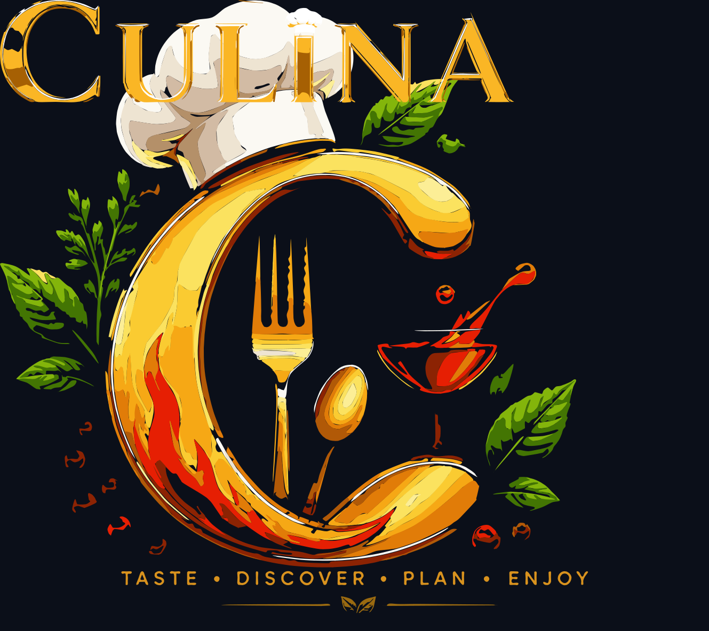

<p align="center"></p>

# CULINA

**The Interactive Food Intelligence & Discovery Platform**

> Discover food. Understand it. Make it yours.

[](https://github.com/devara1983ntr/culina/actions/workflows/ci.yml)
[](LICENSE)

CULINA unifies recipes, ingredients, fruit nutrition, packaged food products, cocktails, beer, breweries and coffee from multiple independent open-data sources into **one coherent, editorial-grade product** — with honest labeling of every data source, graceful degradation when a provider fails, and a local-first privacy model (no accounts, no tracking, no cloud).

**TASTE • DISCOVER • PLAN • ENJOY**

---

## Screenshots

| Home (light) | Home (dark) |
| --- | --- |
|  |  |

| Recipes | Recipe detail | Meal planner |
| --- | --- | --- |
|  |  |  |

| Drinks | Search | Mobile (390 px) |
| --- | --- | --- |
|  |  |  |

All screenshots are real captures of the running production build (Chromium 1440×900 / 390×844).

## Quick start

```bash
npm install        # install dependencies (vite, motion, lucide, sortablejs, fontsource fonts)
npm run dev        # dev server with hot reload  (http://localhost:5173)
npm test           # 70 unit/integration tests (node:test — no extra deps)
npm run build      # production build → dist/
npm start          # production gateway + static server on 0.0.0.0:$PORT (default 3000)
```

The dev server and the production gateway both provide the `/api/fruityvice` reverse proxy needed by the one CORS-restricted provider (see [Architecture](#architecture)).

## What's inside

| Area | Highlights |
| --- | --- |
| **Unified search** | One query across 7 live providers (recipes, cocktails, fruits, products, breweries, beers, coffee) — `Promise.allSettled` isolation, dedupe, deterministic scoring, per-group ranking |
| **21 routes** | Home, Discover, Search, Recipes, Recipe detail, Ingredients, Ingredient detail, Nutrition, Products, Product detail, Drinks hub, Cocktails, Cocktail detail, Beer, Breweries, Coffee, Kitchen match, Planner, Favorites, API Health, About (+ offline page) |
| **What can I cook?** (`/kitchen`) | Add what's in your kitchen → recipes ranked by ingredient overlap, with the exact match count stated on every card |
| **Meal planner** (`/planner`) | 7 days × 3 meals, drag & drop (SortableJS) with button alternatives, duplicate/remove, merged shopping list with unit-aware quantity math |
| **Favorites** | Per-entity collections, local-first, live badge in the header |
| **Surprise me** | Weighted random discovery across recipes, cocktails, fruits, breweries and food imagery |
| **API Health center** (`/health`) | Live status, latency, classification and on-demand diagnostics for all 28 registered providers — passive telemetry only, no background polling |
| **PWA** | Installable, offline fallback page, service worker (network-first navigations, immutable asset cache, TTL-capped API cache) |
| **Design** | Approved brand identity ([board](docs/brand/culina-brand-board.png)) — Ember Gold / Spicy Orange / Fresh Green / Deep Crimson / Midnight / Cream, Playfair Display + Inter, light/dark themes (persisted), WCAG 2.2 AA targets (contrast-verified tokens), `prefers-reduced-motion` support, mobile-first at 6 breakpoints |

## Brand identity

The approved identity lives in [`docs/brand/culina-brand-board.png`](docs/brand/culina-brand-board.png):
a golden/orange **C** incorporating a chef hat, fork, spoon, fresh green leaf,
cocktail element and culinary flame, presented on Midnight with Cream
typography — *TASTE • DISCOVER • PLAN • ENJOY*.

- **Palette** — Ember Gold `#FFB703` · Spicy Orange `#FB5607` · Fresh Green `#2ECC71` · Deep Crimson `#E63946` · Midnight `#0B0F19` · Cream `#FFF7E6`. Deepened/lightened shades of these hues appear only where WCAG 2.2 AA contrast requires them (every pairing verified by `scripts/verify-contrast.py`).
- **Typography** — Playfair Display for editorial display moments, Inter for UI/body. Self-hosted via Fontsource (OFL), subset to latin, `font-display: swap`.
- **Assets** — all brand geometry (mark, tile, wordmark, logo lockups, favicons, PWA icons, OG/Twitter cards) is generated from a single source: `python3 scripts/generate-brand-assets.py` then `node scripts/rasterize-brand.mjs`. The app embeds the canonical tile as a generated module (`js/components/mark-tile.js`), mirrored byte-for-byte to `assets/brand/` and `public/brand/` — asserted by the gateway test suite.

## Architecture

```
UI (pages · components)          ← never sees provider field names
        │  unified domain models (Recipe, Ingredient, Drink, Brewery, Product, Nutrition)
State & services                 ← search · favorites · planner · shopping · surprise · health
        │  normalized requests
API client                       ← timeout · retry · in-flight dedupe · TTL cache · error normalization
        │
Adapters (1 per provider)  +  Provider registry (28 entries, machine-readable)
        │
DIRECT providers  →  browser → third-party HTTPS (CORS-enabled)
PROXY_REQUIRED    →  browser → same-origin gateway (/api/fruityvice) → third-party
```

- **Normalizers are pure functions** — unknown values become `null`, never `0`, never fabricated. Nutrition data that a provider doesn't carry is absent, not invented.
- **One failed provider never sinks a page** — multi-provider views render what succeeded and show a precise partial-failure notice for the rest.
- **Adding a provider** = 1 registry entry + 1 adapter + 1 normalizer. Nothing else in the app changes.

### The gateway (`server.js`)

A zero-dependency Node server that serves `dist/` with SPA fallback and exposes a **strictly allowlisted** reverse proxy for CORS-restricted providers (currently Fruityvice, paths `/api/fruit/(all|\d+)` only). No API keys are involved anywhere in this project — key-requiring providers are registered but disabled with an honest "Configuration required" state, exactly as they would be integrated (server-side, secrets in the server environment only).

## Provider matrix (verified 2026-09-02)

The machine-readable source of truth is [`js/api/registry.js`](js/api/registry.js); live status is always visible at `/health`.

### Enabled (8 live providers)

| Provider | Powers | Access | Notes |
| --- | --- | --- | --- |
| TheMealDB | Recipes, ingredients, areas, categories | Direct | Community test key documented by provider; images via `/preview` variant |
| TheCocktailDB | Cocktails, glasses, IBA lists | Direct | Same model as TheMealDB |
| Fruityvice | Fruit profiles + per-100 g nutrition | **Gateway** | No ACAO header → proxied via `/api/fruityvice` |
| Foodish | Hero food imagery | Direct | Only `/api/` random endpoint is reliable |
| Open Brewery DB | Breweries (11,800+) | Direct | No `/random`; adapter randomizes page 1–220; 120 req/window rate limit — results cached |
| Open Food Facts | Products, Nutri-Score, NOVA, nutrition | Direct | Text search is intermittently 503 (server load) → adapter retries; barcode lookup is reliable |
| SampleAPIs — Coffee | Hot & iced brewing guides | Direct | Community dataset |
| SampleAPIs — Beers | Ales & stouts with ratings | Direct | Community dataset (PunkAPI went offline — labeled honestly, ABV/brewery not invented) |

### Registered but not enabled (20)

| Classification | Providers | Why |
| --- | --- | --- |
| `API_KEY_REQUIRED` | Spoonacular, Edamam (×2), Tasty, RecipeAPI, Zestful, Chomp, Food Info, Systembolaget | No secrets in the browser — would need a keyed gateway; shown as "Configuration required" |
| `OAUTH_REQUIRED` | Kroger, Untappd | OAuth flows out of scope for a keyless build |
| `UNAVAILABLE` | PunkAPI, LCBO, RustyBeer, TacoFancy, NYPL What's on the Menu | Dead endpoints (NXDOMAIN) or HTTP-only — verified, not guessed |
| `DISABLED` | BaconMockup, Coffee (alexflipnote), WhiskyHunter, Report of the Week | Reachable but superseded by better sources for the same data |

## Testing & quality gates

```bash
npm test            # 70 unit tests (48 core + 22 expansion), 0 failures
npm run audit       # static audit: imports, CSS class coverage, icon registry, routes & links
npm run build       # production build → dist/
npm run test:ui     # browser E2E (92 checks; needs playwright-core + @sparticuz/chromium, see below)
```

**Unit tests** (`node --test`):

- **`tests/normalizer.test.js`** — every provider payload shape → unified model; the "unknown → null, never 0" rule
- **`tests/client.test.js`** — timeout, retry (429/5xx), no-retry (404/401), cache, in-flight dedupe, error typing, gateway URL resolution
- **`tests/search.test.js`** — deterministic scoring, dedupe, ranking, partial-failure isolation, abort handling
- **`tests/storage.test.js`** — favorites, planner (move/duplicate/cap), shopping-list merging (unit-aware, never sums tbsp + g)
- **`tests/expansion.test.js`** — input validation & limits, settings (theme cycling/persistence, corrupt-JSON sanitize), history (dedupe, caps, gating), shopping list (manual items, case/diacritic-insensitive keys), planner shape (7 days × 4 meal slots incl. snacks), full route ↔ loader audit, friendly error copy for every error type

The test suite caught five real bugs before shipping (broken import paths, a wrong `ErrorType` key that collapsed all HTTP errors to `UNKNOWN_ERROR`, double error-wrapping, missing adapter exports, cross-test storage pollution).

**Static audit** (`scripts/audit.mjs`, `npm run audit`): every relative import resolves; every class used in JS exists in a stylesheet (template-literal aware); every `icon()` name exists in lucide **and is registered in `js/utils/icons.js`**; every route has a loader and every static internal link matches a route shape.

**Gateway tests** (`scripts/gateway-test.mjs`): **72 assertions** against the production server — security headers (CSP with startup-computed script hash, nosniff, DENY, Referrer-Policy, Permissions-Policy, COOP), SPA fallback, asset immutability, proxy path allowlist, method guard, `/healthz`, path-traversal defense, sitemap coverage, manifest MIME, `X-Robots-Tag` on app-internal routes, and the full brand-asset contract (SVG/PNG assets, exact dimensions, byte-identical canonical mirrors, manifest colors/icons).

**Browser E2E** (`npm run test:ui` → `scripts/run-qa.mjs`, which runs `scripts/browser-qa.mjs` and re-runs the full suite exactly once — loudly, and only when every failure is infrastructure-class such as a sandboxed browser death; assertion failures never trigger a retry): **92 checks** against the production build, grouped in ten sections — (A) all 34 surfaces incl. deep links, boot splash, planner grid, sticky recipe action bar; (B) horizontal-overflow matrix across 320–1440 px on 6 pages; (C) mobile bottom nav (visibility, 5 destinations, active state, body clearance, hidden on desktop); (D) ⌘K/K command palette (commands, `>` filter mode, Enter executes, Escape, `/` shortcut); (E) theme switching + persistence across reload; (F) history recording and shopping-list manual items + inline validation + check persistence; (G) SPA navigation without reload, back/forward; (H) failure injection — offline detection toast, provider outage → graceful error state with no stuck skeletons, recovery, malformed-JSON safety, and a no-stuck-loading audit; (I) accessibility — landmarks, heading outline, skip-link focus, focus ring, ≥44 px touch targets, aria-hidden decorative icons, image alts, contrast spot-checks in both themes, dialog focus/Escape; (J) PWA & performance — service-worker control, **offline hard-reload serving the cached shell**, honest offline states, online recovery, and a navigation-timing baseline; (K) brand identity & metadata — header C-mark, Playfair wordmark, favicon set, absolute OG/Twitter images, splash asset, brand/social asset resolution, manifest colors, footer + About tagline and developer credit. Requires a one-time setup outside the project:

```bash
npm i -g playwright-core @sparticuz/chromium   # or install locally and run from that directory
npm run test:ui                                # with the server running on :3000
```

Notes: route interception patterns must be **RegExp** — playwright-core 1.6x scheme-less globs don't match cross-origin URLs; the suite blocks raster images at the network layer (the ~2 GB sandbox OOMs otherwise) and recycles pages between sections because headless single-process chromium accumulates renderer memory.

Runs on **Chromium and Firefox** (`CULINA_QA_ENGINE=firefox CULINA_QA_EXECUTABLE=<path> npm run test:ui`).

Last run: **92/92 on Chromium and Firefox (two consecutive runs per engine), no unexpected console/page errors.**

## Deployment

The production artifact is `dist/` served by the zero-dependency gateway:

```bash
npm run build     # → dist/
npm start         # node server.js — static + SPA fallback + allowlisted proxy on $PORT (default 3000)
```

What the gateway provides (all verified by `scripts/gateway-test.mjs`):

- **Security headers on every response**: enforced CSP (`script-src 'self'` + a startup-computed SHA-256 hash of the single inline theme-bootstrap script; `connect-src` limited to the enabled provider origins), `X-Content-Type-Options`, `X-Frame-Options: DENY` + `frame-ancestors 'none'`, `Referrer-Policy`, `Permissions-Policy` (microphone deliberately allowed — voice search), COOP, and HSTS when the request arrives over HTTPS.
- **SPA routing**: unknown paths fall back to the shell; assets with extensions 404 properly; hashed `/assets/*` are `immutable`.
- **Allowlisted reverse proxy** (`/api/fruityvice/*` — strict path regex, GET only, 12 s upstream timeout) for the one CORS-restricted provider. A key-requiring provider would use the same pattern with the key in this process's environment, never in the browser bundle.
- **`/healthz`** for uptime checks (`no-store`).
- **`X-Robots-Tag: noindex`** on `/settings`, `/history`, `/favorites`, `/offline` (personal/app pages; the client also sets `<meta name="robots">` on SPA navigation).

Operator checklist for a public deployment:

1. Terminate TLS at your proxy and forward `X-Forwarded-Proto` (the gateway then sends HSTS).
2. Run `node scripts/set-origin.mjs https://your.origin/ dist` after the build — it makes the sitemap `<loc>` values, the robots.txt Sitemap line and the social images absolute for your origin.
3. Point your uptime monitor at `/healthz`.
4. Rollback = redeploy the previous `dist/` (immutable asset hashes make this safe).

### GitHub Pages (static hosting)

`deploy.yml` publishes to GitHub Pages on green pushes to `main`:
`vite build --base=/culina/` → `set-origin.mjs` → copy `index.html` to `404.html` → deploy.

- **SPA deep links** work because the static 404 page boots the app, which routes client-side; once the service worker controls the page, navigation requests are served from the offline shell.
- **Service worker, manifest and icons are deployment-agnostic** (scope-relative URLs, verified in the sub-path build).
- **Known limitation:** GitHub Pages cannot host the `/api/fruityvice` reverse proxy, so the fruit provider degrades to its honest "configuration required" state on Pages — exactly as the health center reports. Every other provider is called directly (CORS-open) and works fully. Security headers (CSP, HSTS, …) are a gateway feature; on Pages you get GitHub's platform headers instead. For the full contract, deploy `dist/` behind `server.js` or any static host plus the documented proxy.

## CI/CD

`.github/workflows/ci.yml` runs on every push/PR:

1. **quality** job — `npm ci` → 70 unit tests → static audit → production build → `npm audit --audit-level=high` → 72 gateway assertions → dist artifact upload.
2. **e2e** job (matrix: **Chromium + Firefox**) — rebuild, install browsers via `playwright-core`, boot the production gateway, run the 92-check browser suite, then a post-run smoke test (`/healthz`, shell title, CSP header).
3. **deploy** job (`.github/workflows/deploy.yml`) — on green pushes to `main`, builds for the GitHub Pages sub-path, rewrites the deployment origin into sitemap/robots/social images, and publishes. A deployment must only happen from a green pipeline; failures in any gate block promotion — nothing is configured to be ignored.

## Browser support

| Browser | Status | Evidence |
| --- | --- | --- |
| Chrome/Chromium desktop (headless) | **Tested** — full 92-check E2E | `npm run test:ui` (default engine) |
| Firefox desktop (Playwright's Firefox build) | **Tested** — full 92-check E2E | `CULINA_QA_ENGINE=firefox` |
| Safari / iOS Safari | **Not tested** in this environment — no sandbox availability | Uses only evergreen web platform features (native `<dialog>`, ES2020, CSS custom properties); voice search is feature-detected and absent where unsupported |
| Chrome Android | **Not tested** (no device); mobile layout verified via 320–430 px viewports + touch-target audits | E2E section B/C |
| Edge | **Not tested**; Chromium-engine — expected to track the Chromium results | — |

Claims above reflect actual test runs; untested targets are listed as untested.

## Troubleshooting

- **`vite: not found`** → run `npm ci` (node_modules is not committed).
- **E2E "provider outage" fails with real cards rendering** → an active service worker fetched the data itself (by design). The suite isolates injection tests in a `serviceWorkers: 'block'` context; if you adapt the tests, keep that isolation.
- **E2E browser crashes (low-memory runners)** → the suite already blocks raster images and recycles pages; give the runner more RAM or run engines separately.
- **Fonts/icons missing in a reverse-proxied deployment** → keep `/assets/*` served with the immutable cache header and don't rewrite asset paths.

## Project structure

```
culina/
├── index.html                 # shell: meta, OG, header/main/footer roots, dialog root
├── server.js                  # production gateway: static + allowlisted reverse proxy
├── vite.config.js             # build config + dev/preview provider proxy
├── css/                       # tokens → reset → base → layout → components → pages → utilities → responsive
├── js/
│   ├── api/                   # client (cache/retry/dedupe), errors, registry (28 providers), health telemetry
│   │   └── adapters/          # 8 adapters + index (static map — Vite-analyzable)
│   ├── components/            # 15 UI components (states, toast, modal, cards, tabs, filters, …)
│   ├── pages/                 # 21 route modules (shared.js = page scaffolding helpers)
│   ├── services/              # search, favorites, planner, shopping, surprise
│   ├── utils/                 # dom, format, icons (lucide), motion (reveal), a11y
│   └── app.js / main.js       # router bootstrap, page loaders, error boundary, SW registration
├── public/                    # manifest, sw.js, offline.html, robots, sitemap, icons, brand/, social/
├── assets/brand/              # canonical brand SVGs (mirrored to public/brand, asserted byte-equal)
├── scripts/                   # generate-brand-assets.py, rasterize-brand.mjs, verify-contrast.py, set-origin.mjs,
│                              # browser-qa.mjs + run-qa.mjs (infra-retry wrapper), audit.mjs, gateway-test.mjs
├── tests/                     # 5 test files + helpers
├── docs/                      # API-VERIFICATION, DESIGN-DECISIONS, GAP-REGISTER, RELEASE-CHECKLIST, audits,
│                              # screenshots/, brand/ (approved board)
└── design-system/culina/MASTER.md   # generated design system (UI/UX Pro Max skill)
```

## Deployment

1. `npm run build`
2. Serve `dist/` with `server.js` (`npm start`, `PORT` env respected) — or any static host **plus** a proxy for `/api/fruityvice/*` (see `vite.config.js` for the exact rewrite). Without the gateway, fruit features degrade honestly to a "configuration required" state instead of failing silently.
3. Set the absolute sitemap URL in `public/robots.txt` for your domain.

The service worker registers only on `https` or `localhost` and version-busts its caches on deploy (`STATIC_CACHE` is version-keyed).

## Privacy & security

- Favorites, planner, theme and health telemetry live in `localStorage` only — clearing site data resets everything.
- No accounts, analytics, cookies-for-tracking, or outbound data of any kind.
- All provider URLs pass through an http(s)-only sanitizer; no third-party HTML is ever injected as markup (no `innerHTML` on remote data).
- The gateway allowlists upstream paths, blocks non-GET proxy traffic, and guards path traversal.

## Accessibility

WCAG 2.2 AA targets: semantic landmarks and skip link, visible focus everywhere, full keyboard support (roving-tabindex tabs, native `<dialog>` modals, arrow-key search palette), aria-live status messages, 4.5:1 contrast in both themes, ≥44 px touch targets, `prefers-reduced-motion` respected, and text alternatives wherever data is visualized.

## License & attribution

Application code: MIT (see [`LICENSE`](LICENSE)). Fonts: Playfair Display & Inter via Fontsource (SIL OFL 1.1). Data and imagery remain the property of their providers — every result card carries a source badge, detail pages include a full source panel (license, rate limits, attribution link), and Open Food Facts data is ODbL-licensed. CULINA aggregates for discovery purposes and offers no dietary or medical advice.

---

**Designed & developed by Roshan** — with honest data, honest states and no shortcuts.
